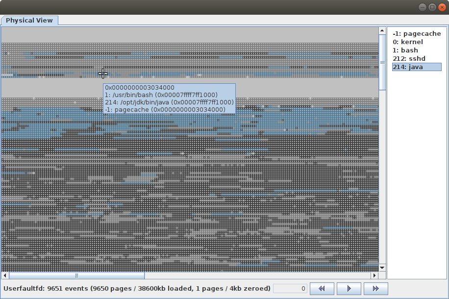
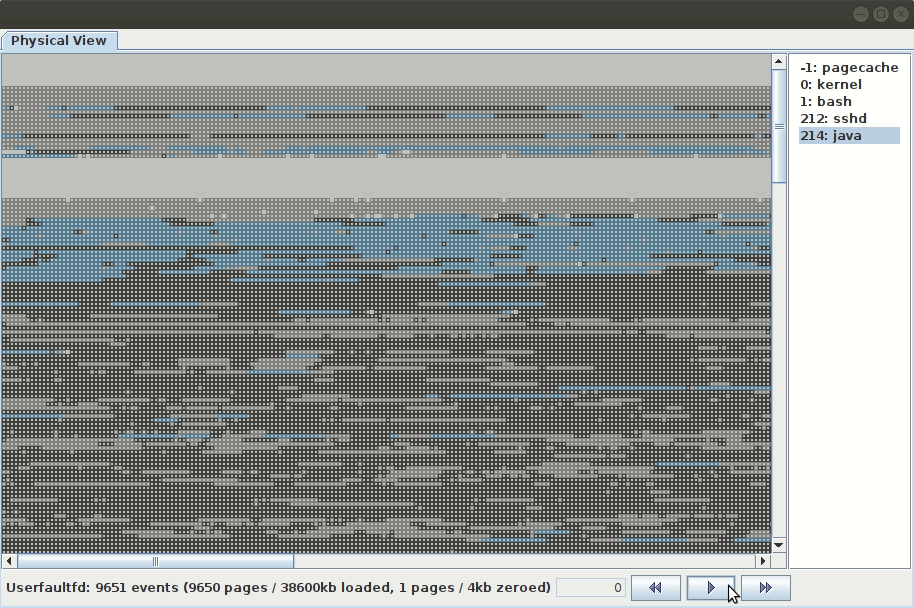
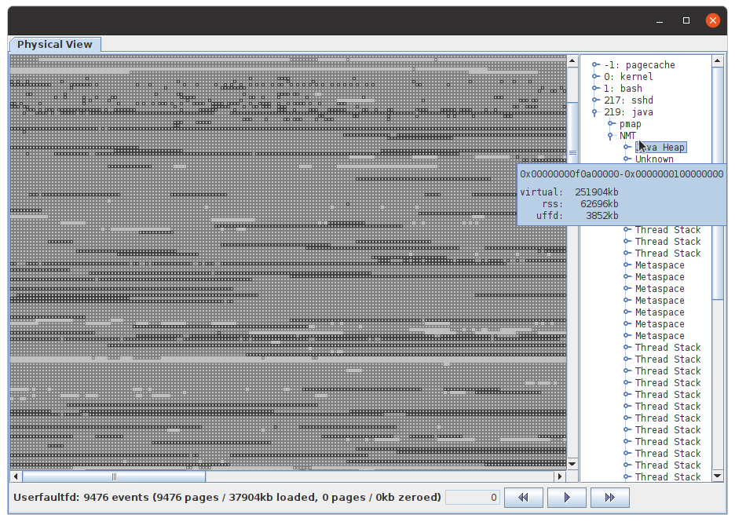
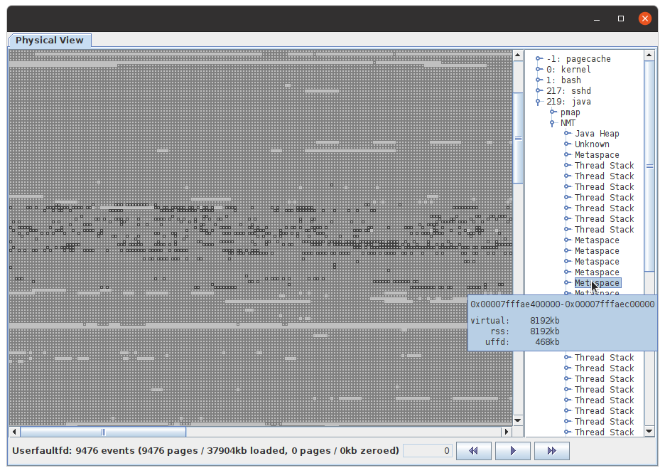
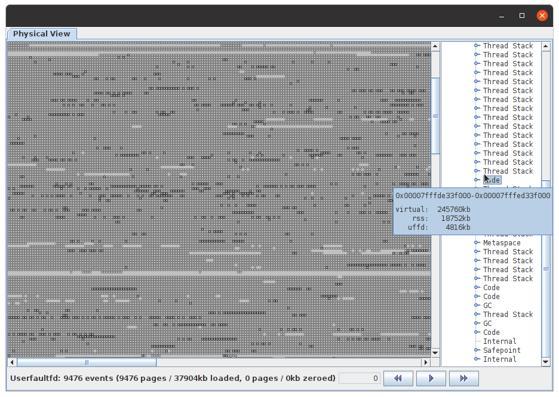
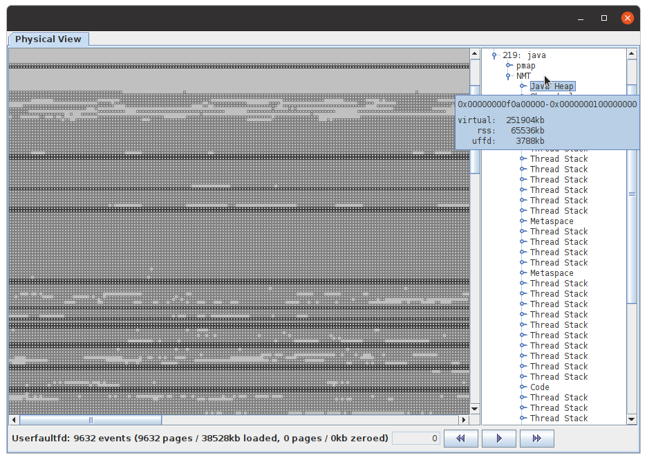
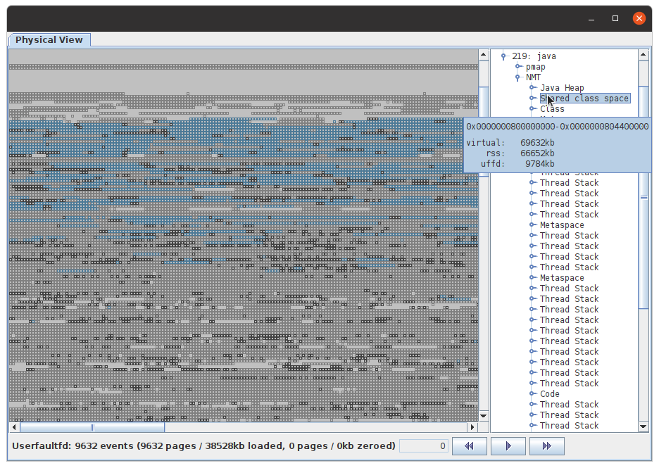
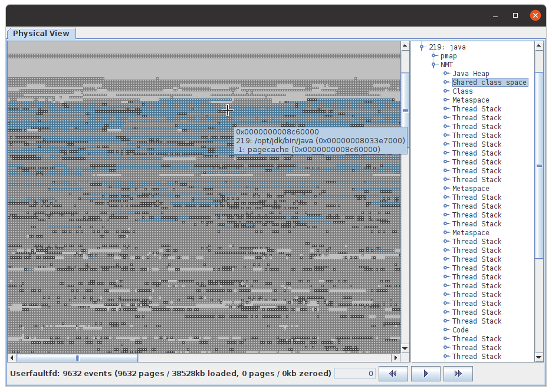
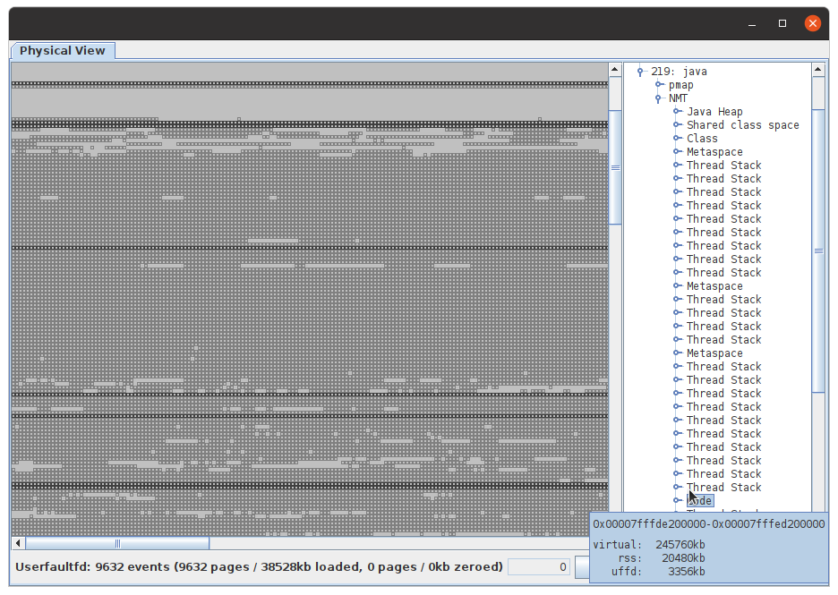

This project is for experimenting and investigating how OpenJDK and [CRaC](https://wiki.openjdk.org/display/crac) can be used inside the [Firecracker](https://firecracker-microvm.github.io/) microVM.

### Getting started

The following instructions and scripts are based un Ubuntu (18.04 / 22.04) and require the installation of certain packages like [docker](https://docs.docker.com/engine/install/ubuntu/), [Firecracker](https://firecracker-microvm.github.io/), etc. Running the scripts should give you appropriate error messages in the case some tools are missing.

```
$ ./makeKernel.sh
```
This will build a linux kernel in a Docker container (see [`./Dockerfile.kernel`](./Dockerfile.kernel)) and copy it to `deps/vmlinux`.
```
$ ./makeRootFS.sh
```
This will use another Docker container (see [`./Dockerfile.ubuntu22`](./Dockerfile.ubuntu22)) to create an Ubuntu 22.04-based ext4 root file system in `./deps/rootfs.ext4` which contains a CRaC-enabled version of OpenJDK 17 (by default from https://firecracker-microvm.github.io/ and cached under `./deps/jdk`) and a slightly customized version of the [Spring Petclinic](https://github.com/spring-projects/spring-petclinic.git) demo application from https://github.com/simonis/spring-petclinic/tree/volkers-experiments. It also builds a [Userfaultfd](https://docs.kernel.org/admin-guide/mm/userfaultfd.html) page fault handler to `./deps/uffd_handler` (see [./tools/uffd/](./tools/uffd/)), the [UffdVisualizer](./tools/UffdVisualizer/) to `./deps/UffdVisualizer.jar` and a simple [SuspendResume agent](./tools/SuspendResumeAgent/) to `deps/SuspendResumeAgent.jar` which we will need [later for our experiments](#restoring-firecracker-with-userfaultfd).

#### Running Java/Petclinic in Firecracker

```
$ ./fireCRaCer.sh
/dev/kvm not readable! This is required to run firecracker.
running: setfacl -m u:ubuntu:rw /dev/kvm
tap device tap0 not configured (Device "tap0" does not exist.)
Running:
  sudo ip tuntap add dev tap0 mode tap
  sudo ip addr add 172.16.0.1/24 dev tap0
  sudo ip link set tap0 up
...
```
When executed for the first time, `fireCRaCer.sh` will make `/dev/kvm` readable (by calling [`setfacl`](https://linux.die.net/man/1/setfacl)) and create a tap device `tap0` before starting a Firecracker microVM with the kernel and root files system we've just built.

```
...
Running: firecracker --boot-timer --api-sock /tmp/fireCRaCer-tap0.socket --config-file /tmp/vmconfig.Zgvm5x
[    0.000000] Linux version 5.19.8 (root@e823d5d52f4f) (gcc (Ubuntu 7.5.0-3ubuntu1~18.04) 7.5.0, GNU ld (GNU Binutils for Ubuntu) 2.30) #1 SMP PREEMPT_DYNAMIC Fri Nov 25 10:36:55 UTC 2022
[    0.000000] Command line: console=ttyS0 reboot=k panic=1 pci=off i8042.noaux i8042.nomux i8042.nopnp i8042.dumbkbd tsc=reliable ipv6.disable=1 nomodules randomize_kstack_offset=n norandmaps mitigations=off  overlay_root=ram overlay_size=128m ip=172.16.0.2::172.16.0.1:255.255.255.0::eth0:off init=/opt/tools/ro_init.sh root=/dev/vda ro virtio_mmio.device=4K@0xd0001000:5 virtio_mmio.device=4K@0xd0002000:6
...
[    0.263309] Run /opt/tools/ro_init.sh as init process
[    0.298988] Successfully overlayed read-only rootfs with /dev/ram
[    0.300188] Now starting /opt/tools/crac_init.sh
[    0.303969] crac_init.sh: Starting petclinic
openjdk version "17-crac" 2021-09-14
...
2022-11-25 12:53:25.929  INFO 206 --- [           main] o.s.s.petclinic.PetClinicApplication     : Started PetClinicApplication in 5.954 seconds (JVM running for 8.737)
```
From another terminal, you can verify that Petclinic is running (also notice the log output in the terminal where we started Firecracker):
```
$ curl -s -o /dev/null -L -w ''%{http_code}'\n' 172.16.0.2:8080
200
```
and shut down the Firecracker microVM by executing `./fireCRaCer.sh -k`.
```
$ fireCRaCer.sh -k
Killing firecracker instance running on tap device tap0
Kill: OK
```

#### Snapshotting &amp; Restoring Firecracker

Once we've started Firecracker, we can take a [snapshot](https://github.com/firecracker-microvm/firecracker/blob/main/docs/snapshotting/snapshot-support.md) of the running microVM and save it to disk:
```
$ fireCRaCer.sh -s /tmp/snapshot_tap0
Suspend: OK
Snapshot: OK
Resumed: OK
```
For this, the script suspends the microVM first, then it writes the snapshot to `/tmp/snapshot_tap0` and finally it resumes the the microVM again.

We can restore a snapshotted microVM with the following command:
```
$ fireCRaCer.sh -r /tmp/snapshot_tap0
Running: firecracker --boot-timer --api-sock /tmp/fireCRaCer-tap0.socket
Restore: OK
...
```
By executing `curl -s -o /dev/null -L -w ''%{http_code}'\n' 172.16.0.2:8080` from another terminal window, we can verify that Petclinic has indeed been resurrected and is running:
```
2022-11-28 11:37:06.141 DEBUG 206 --- [nio-8080-exec-1] o.a.c.authenticator.AuthenticatorBase    : Security checking request GET /
2022-11-28 11:37:06.148 DEBUG 206 --- [nio-8080-exec-1] o.a.c.authenticator.AuthenticatorBase    : Not subject to any constraint
2022-11-28 11:37:06.153  INFO 206 --- [nio-8080-exec-1] o.a.c.c.C.[Tomcat].[localhost].[/]       : Initializing Spring DispatcherServlet 'dispatcherServlet'
2022-11-28 11:37:06.155  INFO 206 --- [nio-8080-exec-1] o.s.web.servlet.DispatcherServlet        : Initializing Servlet 'dispatcherServlet'
2022-11-28 11:37:06.162  INFO 206 --- [nio-8080-exec-1] o.s.web.servlet.DispatcherServlet        : Completed initialization in 5 ms
```

##### Restoring Firecracker with `userfaultfd`

Instead of relying on the host kernel to page in the snapshotted microVM main memory from the corresponding file in the snapshot directory, [Firecracker can be instructed](https://github.com/firecracker-microvm/firecracker/blob/main/docs/snapshotting/handling-page-faults-on-snapshot-resume.md) to use a [userfaultfd](https://www.kernel.org/doc/html/latest/admin-guide/mm/userfaultfd.html) page fault handler instead. The following command will resume our snapshot by serving the page faults from the previously built page fault handler `deps/uffd_handler` (derived from Firecracker's [`tests/host_tools/uffd/src/bin/valid_handler.rs`](https://github.com/firecracker-microvm/firecracker/blob/main/tests/host_tools/uffd/src/bin/valid_handler.rs) test uffd handler).

```
$ fireCRaCer.sh -r /tmp/snapshot_tap0 -u
Running: deps/uffd_handler -v /tmp/fireCRaCer-uffd-tap0.socket /tmp/snapshot_tap0/mem_file > /tmp/fireCRaCer-uffd-tap0.log 2>&1
Running: firecracker --boot-timer --api-sock /tmp/fireCRaCer-tap0.socket
Restore: OK
...
```
Looking at the log file of the uffd handler we can see how it serves page fault requests:
```
$ tail /tmp/fireCRaCer-uffd-tap0.log
UFFD_EVENT_PAGEFAULT (r): 0x00007fffb3cc0000 0x00007fffb3cc0000  Loading: 0x0000000003cc1000 - 0x0000000003cc2000
UFFD_EVENT_PAGEFAULT (r): 0x00007fffb3cc8000 0x00007fffb3cc8000  Loading: 0x0000000003cc9000 - 0x0000000003cca000
UFFD_EVENT_PAGEFAULT (r): 0x00007fffb4264000 0x00007fffb4264000  Loading: 0x0000000004265000 - 0x0000000004266000
UFFD_EVENT_PAGEFAULT (r): 0x00007fffb2dff000 0x00007fffb2dff000  Loading: 0x0000000002e00000 - 0x0000000002e01000
UFFD_EVENT_PAGEFAULT (w): 0x00007fffb4265000 0x00007fffb4265000  Loading: 0x0000000004266000 - 0x0000000004267000
UFFD_EVENT_PAGEFAULT (w): 0x00007fffb3cc1000 0x00007fffb3cc1000  Loading: 0x0000000003cc2000 - 0x0000000003cc3000
UFFD_EVENT_PAGEFAULT (w): 0x00007fffb4497000 0x00007fffb4497000  Zeroing: 0x0000000004498000 - 0x0000000004499000
```

##### Visualizing page usage on restore

We can use the output of the `userfaultfd` page fault handler to visualize the order of page acesses during restore. But `userfaultfd` only emits the virtual host and physical gest addresses. In order to make sense of the physical guest addresses we will have to collect the mapping of virtual to physical addresses for every process in the guest VM. To do this, we start our example VM with the environment variable `BOOT_ARGS="sshd=true"`. The value of `BOOT_ARGS` is passed as a kernel boot parameter to Firecracker and handled by the init script [`ro_init.sh`](./tools/ro_init.sh) in our image:

```
$ BOOT_ARGS="sshd=true" fireCRaCer.sh
...
[    0.000000] Command line: ...init=/opt/tools/ro_init.sh sshd=true...
...
[    0.284914] Run /opt/tools/ro_init.sh as init process
[    0.314593] Starting ssh daemon
...
2022-11-30 20:17:34.162  INFO 212 --- [           main] o.s.s.petclinic.PetClinicApplication     : Started PetClinicApplication in 7.503 seconds (JVM running for 14.093)
```
We can now ssh into the newly started VM (using the private key from [`docker/firecracker_id_rsa`](./docker/firecracker_id_rsa)), execute the [`mem_mapping.sh`]() script and redirect its output to `/tmp/mem_mapping1.txt`:
```
$ ssh -i docker/firecracker_id_rsa root@172.16.0.2 '/opt/tools/mem_mapping.sh' > /tmp/mem_mapping1.txt
$ cat /tmp/mem_mapping1.txt
= 1 /usr/bin/bash
v 0x0000555555554000 0x0000555555583000 /usr/bin/bash
p 0x0000555555554000 0x0000000001ff7000 0 1
p 0x0000555555555000 0x0000000001ff6000 0 1
...
= 214 /opt/jdk/bin/java
v 0x00000000f0a00000 0x00000000f2270000
p 0x00000000f0a00000 0x00000000063d4000 1 0
...
= 0 kernel
v 0x0000000001000000 0x0000000001a00587 Kernel code
p 0x0000000001000000 0x0000000100000000
= -1 pagecache
v 000000000000000000 0x000000003d47d000 /proc/kpageflags
p 0x0000000001a01000 0x0000000400000868
...
```
For every user process running in the VM, `/tmp/mem_mapping1.txt` contains a line of the form "`= 1 /usr/bin/bash`" where "`1`" is the PID of the process and "`/usr/bin/bash`" the executable name. This line is followed by lines of the form "`v 0x0000555555554000 0x0000555555583000`" for each virtual mapping of the process and contains the virtual start and end address of that mapping (see [`/proc/<pid>/maps`](https://man7.org/linux/man-pages/man5/proc.5.html)). Finally, each virtual mapping line is followed by lines of the form `p 0x0000555555554000 0x0000000001ff7000 0 1` which map a virtual page address to the corresponding pysical address for pages which have been loaded into physical memory (see "[Examining Process Page Tables](https://www.kernel.org/doc/html/latest/admin-guide/mm/pagemap.html)").

The `kernel` and `pagecache` sections are a little different, because they don't contain virtual addresses. For the `kernel` data, the virtual mapping lines contain the physical start and end addreses for the "Kernel {code, data, bss}" segments in `/proc/iomem` and the lines starting wih "`p `" display a physical page address followed by the korresponding kernel page flags from [`/proc/kpageflags`](https://www.kernel.org/doc/html/latest/admin-guide/mm/pagemap.html#short-descriptions-to-the-page-flags).

For the `pagecache` section there's a single virtual mapping line with the start and end address of the whole physical memory followed by (phsical page address / kernel page flags) pairs for every physical page which has the [`KPF_MAPPEDTODISK`](https://elixir.bootlin.com/linux/v6.0.11/source/include/linux/kernel-page-flags.h#L13) kernel page flag set.

The page visualizer can also use HotSpot's Native Memory Tracking ([NMT](https://docs.oracle.com/en/java/javase/17/vm/native-memory-tracking.html)) output to attribute memory to the various NMT categories. In order to get the NMT data we have to start the Java process in the Firecracker container with `-XX:NativeMemoryTracking=detail`. This can be achieved by passing the java command line parameter through `BOOT_ARGS` like so: `BOOT_ARGS="sshd=true FC_JAVA_OPTIONS=\"-XX:NativeMemoryTracking=detail\""` (`FC_JAVA_OPTIONS` will be appended to the Java options by the `crac_init.sh` script from inside the Firecracker image when starting Petclinic). We can then `ssh` into the Firecracker VM one more time to call `jcmd` as follows:
```
ssh -i ./docker/firecracker_id_rsa root@172.16.0.2 '/opt/jdk/bin/jcmd spring-petclinic VM.native_memory detail' > /tmp/nmt.log
```

With these three files (i.e. `/tmp/mem_mapping1.txt`, `userfaultfd`'s output in `/tmp/fireCRaCer-uffd-tap0.log` and the detailed NMT output in `/tmp/nmt.log`) we can now start the page visualizer:
```
$ java -DuffdVisualizer.scale=4 -jar ./deps/UffdVisualizer.jar /tmp/mem_mapping1.txt /tmp/fireCRaCer-uffd-tap0.log /tmp/nmt.log
Parsed 87629 mappings for 5 processes in 194ms.
Parsed 9651 UFFD events (9650 pages / 38600kb loaded,  1 pages / 4kb zeroed) in 66ms.
Parsed 55 NMT mappings for Java process 219 processes in 66ms.
...
```



The gray background pane in the "Physical View" tab represents the entire physical address space of the microVM. The property `uffdVisualizer.scale` configures the square size of a page in pixels, `uffdVisualizer.width` the number of pages painted in a row and `uffdVisualizer.physicalMemory` the total amount of dispplayed memory. The light-gray squares denote physical pages which are used by at least one process, the kernel or the page cache. Dark-gray and blue squares are the physical pages which belong to the process which has been selected in the list on the right hand side of the window where the light-blue pages are the ones which are used by more than one process. Hovering with the mouse over one of the pages will display additional data like the physical page addres and a list of processes which have mapped that page into their virtual address space. E.g. in the picture above, the physical page at `0x03034000` is used by both, `java` and `bash` and is also a part of the page cache, which means that it probably belongs to a library which is used by both processes (e.g. `libc.so`).

Pressing the play button will start to animate the pages loaded by the `userfaultfd` page fault daemn in the order they were paged into the guest VM when the Firecracker snapshot was restored from the snapshot.



Yellow squares denote pages which belong to the selected process whereas blue squares are pages belonging to other processes, the kernel or the page cache within the guest VM (restarting from a snapshot restarts the whole guest VM, not just a single process in the guest VM).

##### Visualizing the effects of different JVM settings

Lets first look at some of the JVM memory categories as exposed by NMT.



Although the Java heap consists of a single, contiguous virtual address range (from `0x0f0a00000` to `0x0100000000`) we can see that the physical pages currently allocated by the kernel (notice that only `62696kb` out of the reserved `251904kb` have been committed) are quite scattered over the whole physical address range.

The same holds true for the Metaspace:



There's actually a single contiguous virtual address range that was reserved for the whole Metaspace, but NMT reports the Metaspace in several chunks in the order in which these parts where consecutively committed. Again we can see how a contiguous virtual address range is scattered over the physical address range. In the case of the Metaspace the physical "*fragmentation*" is even higher compared to the Java heap because committing of memory in the Metspace happens in smaller chunks.

Finally lets have a look at the code cache which provides a similar picture:



For all the last three pictures you can see that the amount of memory reported as `uffd` (which is the amount of memory loaded at restore time until the first request could be served) is considerable smaller compared to the corresponding `rss` value. E.g. out of `62696kb` heap memory, only `3852kb` have been touched, out of `8192kb` Metaspace, `468kb` have been reloaded and out of `18752kb` JIT-compiled code only `4816kb` where really executed in order to process the first request after resume.

Now lets look at the same memory segments, but for a JVM which was launched with Transparent Huge Pages (`-XX:+UseTransparentHugePages`) and Application Class Data Sharing turned on (`-Xshare:on -XX:SharedArchiveFile=..`):



As you can see, the physical pages which back up the Java heap are still not completely contiguous, but much more regularly layed out in the physical address space because they are now build from 2mb huge pages compared to the 4kb regular pages before.

For the Metaspace we know have one huge virtual mapping for the shared class archive:



Notice that the Metaspace is not backed by huge pages even if we run with `-XX:+UseTransparentHugePages`. The interesting part of this picture are the blue squares which denote memory pages which are shared by more than one process. In this specific case we only ran a single JVM, but because the class data is now directly mapped from the AppCDS archive file, these pages also land in the kernel's page cache:



If a second JVM would be started with the same AppCDS archive, it would map the same physical pages (painted in blue) into its own virtual address space. Both processes will still use the same amount of physical memory (RSS) but they will now occupy a smaller [proportional set size](https://en.wikipedia.org/wiki/Proportional_set_size) (PSS). I.e. together, the two processes would use less physical memory than two times the RSS size of one process, because they share some mount of physical pages.

Finally, when looking at the code cache, we can clearly see that it is backed by huge pages as well which leads to a much less fragmented physical memory layout (comparable to that of the Java heap):

